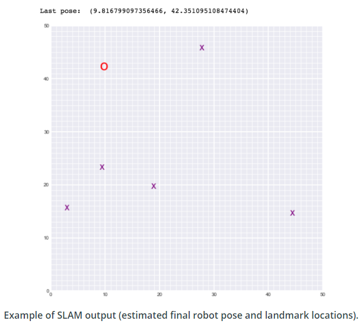

# Landmark Detection & Robot Tracking (SLAM)

## Description

In this project, SLAM (Simultaneous Localization and Mapping) is implemented for a 2 dimensional world. Robot sensor measurements and movement are combined to create a map of an environment from only sensor and motion data gathered by a robot, over time.

SLAM gives us a way to track the location of a robot in the world in real-time and identify the locations of landmarks such as buildings, trees, rocks, and other world features.

This is an active area of research in the field of robotics and autonomous systems.

Below is an example of a 2D robot world with landmarks (purple x's) and the robot (a red 'o') located and found using only sensor and motion data collected by that robot.

  

## Files

- `Notebook 1` : Robot moving and sensing
- `Notebook 2` : Omega and Xi, Constraints
- `Notebook 3` : Landmark detection and tracking
- `robot_class.py` : Robot object with its world
- `helpers.py` : helper functions
